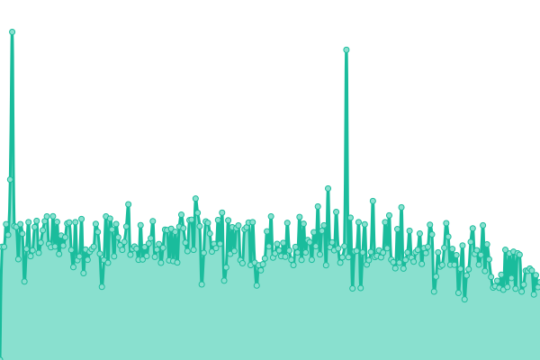
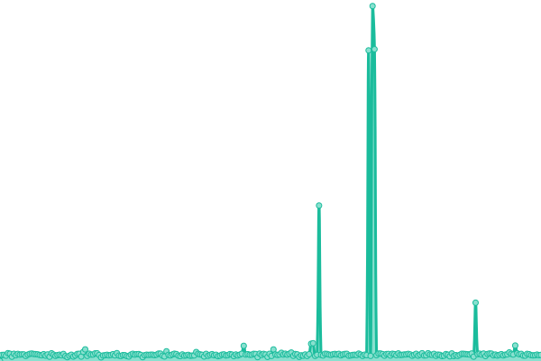
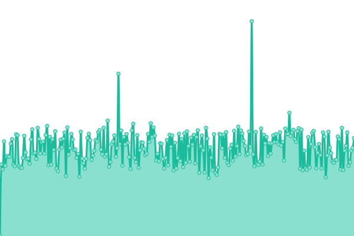
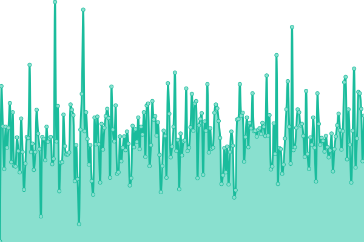

# [📈 Live Status](https://status.davwheat.dev): <!--live status--> **🟩 All systems operational**

This repository contains the open-source uptime monitor and status page for [David Wheatley](davwheat.dev), powered by [Upptime](https://github.com/upptime/upptime).

With [Upptime](https://upptime.js.org), you can get your own unlimited and free uptime monitor and status page, powered entirely by a GitHub repository. We use [Issues](https://github.com/davwheat/api-status/issues) as incident reports, [Actions](https://github.com/davwheat/api-status/actions) as uptime monitors, and [Pages](https://status.davwheat.dev) for the status page.

<!--start: status pages-->
<!-- This summary is generated by Upptime (https://github.com/upptime/upptime) -->
<!-- Do not edit this manually, your changes will be overwritten -->
<!-- prettier-ignore -->
| URL | Status | History | Response Time | Uptime |
| --- | ------ | ------- | ------------- | ------ |
|  [National Rail API Proxy (Huxley2)](https://national-rail-api.davwheat.dev/departures/VIC) | 🟩 Up | [national-rail-api-proxy-huxley2.yml](https://github.com/davwheat/api-status/commits/HEAD/history/national-rail-api-proxy-huxley2.yml) | 

 801ms
     
 | 

<a href="https://status.davwheat.dev/history/national-rail-api-proxy-huxley2">100.00%</a>
    

|  [Flarum Badge API](https://flarum-badge-api.davwheat.dev/v1/compat-latest/flarum/markdown) | 🟩 Up | [flarum-badge-api.yml](https://github.com/davwheat/api-status/commits/HEAD/history/flarum-badge-api.yml) | 

 314ms
     
 | 

<a href="https://status.davwheat.dev/history/flarum-badge-api">100.00%</a>
    

|  [Uploads server](https://u.davwheat.dev/) | 🟩 Up | [uploads-server.yml](https://github.com/davwheat/api-status/commits/HEAD/history/uploads-server.yml) | 

 480ms
     
 | 

<a href="https://status.davwheat.dev/history/uploads-server">100.00%</a>
    

|  [Personal site](https://davwheat.dev/) | 🟩 Up | [personal-site.yml](https://github.com/davwheat/api-status/commits/HEAD/history/personal-site.yml) | 

 161ms
     
 | 

<a href="https://status.davwheat.dev/history/personal-site">100.00%</a>
    

<!--end: status pages-->

[**Visit our status website →**](https://status.davwheat.dev)

## 📄 License

- Powered by: [Upptime](https://github.com/upptime/upptime)
- Code: [MIT](./LICENSE) © [David Wheatley](davwheat.dev)
- Data in the `./history` directory: [Open Database License](https://opendatacommons.org/licenses/odbl/1-0/)
